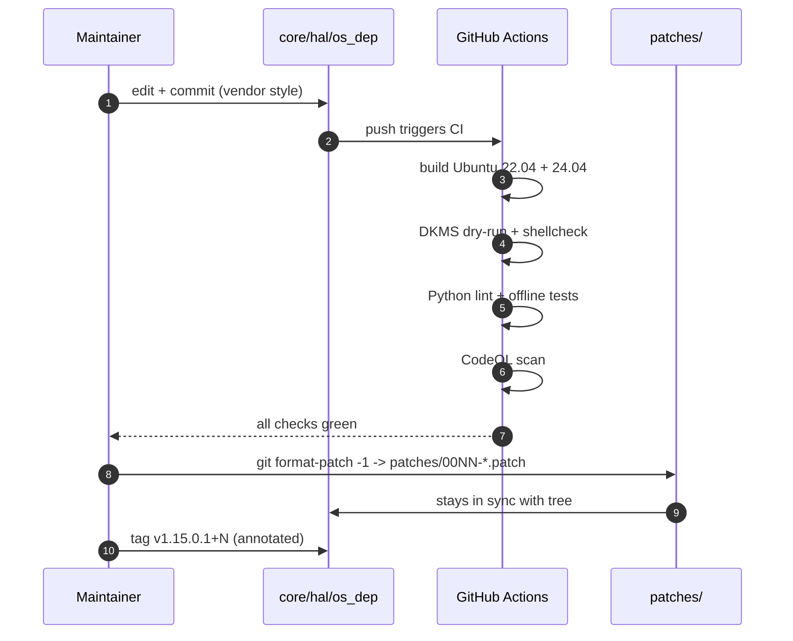
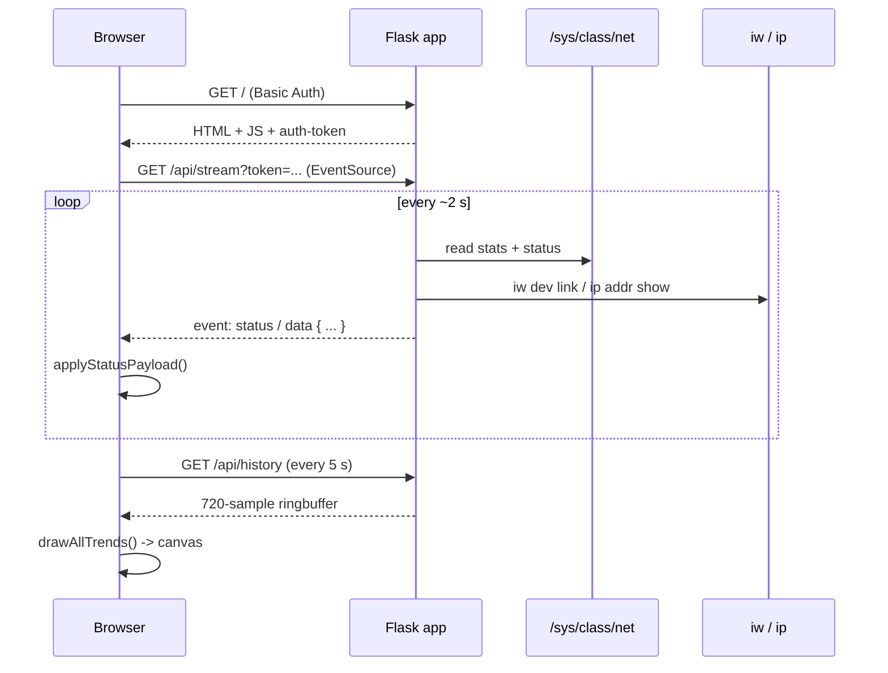

# Architecture

**English** | [Nederlands](architecture.nl.md)

A bird's-eye view of how the moving parts in this repository fit
together. Handy when you've just cloned the fork and you're wondering
where to look first.

## Components at a glance

```mermaid
flowchart TB
    subgraph Hardware ["Hardware"]
        ADAPTER([RTL8852AU USB adapter])
    end

    subgraph Kernel ["Linux kernel space"]
        USBCORE[usbcore]
        CFG80211[cfg80211 / mac80211]
        DRIVER[8852au.ko<br/>out-of-tree module]
        SYSFS[/sys filesystem]
    end

    subgraph BuildPath ["Build path"]
        VENDOR[Realtek vendor source<br/>v1.15.0.1-2]
        PATCHES[patches/0001..0008<br/>post-baseline fixes]
        MAKEFILE[Makefile]
        DKMS[dkms-install.sh<br/>dkms.conf]
        FW[firmware blob<br/>hal8852a_fw.c.xz<br/>CHECKSUMS.sha256]
    end

    subgraph UserSpace ["User-space helpers"]
        DASHBOARD[dashboard/app.py<br/>Flask + SSE]
        TESTS[tests/test_driver.py<br/>+ run_tests.sh]
        TOOLS[tools/tapo_rtsp_brute.py]
    end

    subgraph CI ["GitHub Actions CI"]
        BUILD[Build matrix<br/>Ubuntu 22.04/24.04]
        LINT[Python lint<br/>+ pip --require-hashes]
        DKMSCI[DKMS dry-run<br/>+ shellcheck]
        CODEQL[CodeQL]
    end

    ADAPTER -- USB --> USBCORE
    USBCORE -- bind --> DRIVER
    DRIVER -- registers with --> CFG80211
    DRIVER -- exposes --> SYSFS
    DRIVER -- loads --> FW

    VENDOR --> MAKEFILE
    PATCHES -. integrated into tree .-> VENDOR
    MAKEFILE -- compiles --> DRIVER
    DKMS -- builds + installs --> DRIVER

    DASHBOARD -- reads --> SYSFS
    DASHBOARD -- shells out to --> CFG80211
    TESTS -- exercises --> DRIVER
    TESTS -- shells out to --> CFG80211

    MAKEFILE --> BUILD
    DASHBOARD --> LINT
    TESTS --> LINT
    DKMS --> DKMSCI
    DASHBOARD --> CODEQL
    TESTS --> CODEQL
```

## Where things live

| Directory                | What's in it                                                                  |
|--------------------------|-------------------------------------------------------------------------------|
| `core/`, `hal/`, `phl/`  | Realtek vendor driver source. Keep the vendor style; touch sparingly.         |
| `os_dep/linux/`          | Linux glue layer — netdev, cfg80211, sysfs, USB. Most fork fixes land here.   |
| `include/`               | Shared headers. UBSAN flex-array fix lives in `include/ieee80211.h`.          |
| `phl/hal_g6/mac/fw_ax/`  | Firmware blob (`hal8852a_fw.c.xz`, verified by `CHECKSUMS.sha256`).            |
| `Makefile`, `common.mk`  | Top-level build. Selects kernel headers and compiles `8852au.ko`.             |
| `dkms.conf`, `dkms-*.sh` | DKMS integration; rebuilds automatically on kernel upgrades.                   |
| `patches/`               | Standalone `git format-patch` files for the post-baseline fixes (0001–0008). |
| `dashboard/`             | Flask + Server-Sent-Events web UI. Reads sysfs + `iw` for live status.       |
| `tests/`                 | Python `unittest` suite + `run_tests.sh` wrapper.                              |
| `tools/`                 | Standalone research tools (RTSP credential finder, etc.).                     |
| `docs/`                  | Architecture and dashboard guides (this directory).                            |
| `.github/`               | CI workflow, dependabot, issue + PR templates, CODEOWNERS.                    |

## Lifecycle of a driver fix



## Lifecycle of a dashboard status update



## Why the `patches/` <-> tree split

Every post-baseline change lives in **both places**:

- **In the tree** so `make` produces a working module straight away —
  no patch-apply step for end users.
- **In `patches/`** as a standalone `git format-patch` file so
  downstream maintainers who track only the Realtek baseline can
  `git am patches/*.patch` and end up at the same tree state.

`patches/README.md` is the canonical index. `CHECKSUMS.sha256` keeps
the firmware blob from drifting silently.

## Trust boundaries

| Boundary                          | What crosses it                                       | How it's guarded                                                         |
|-----------------------------------|-------------------------------------------------------|--------------------------------------------------------------------------|
| Kernel ↔ user space               | `iw`, `ip`, `dmesg`, sysfs reads                     | Standard Linux capability model (CAP_NET_ADMIN for ip/iw)                |
| Browser ↔ Flask                   | HTTP requests + Server-Sent Events                    | HTTP Basic Auth + Host-header whitelist + token query parameter          |
| External network ↔ dashboard      | Loopback by default; opt-in via `--host 0.0.0.0`     | Same auth as above. The token is the only secret                         |
| PR contributor ↔ main branch      | Pull requests, fork PR workflow runs                  | Branch protection: CI required, force-push blocked, no fork-secret leak  |
| Realtek blob ↔ runtime            | Firmware loaded by the driver at init                 | SHA-256 verified in CI (`CHECKSUMS.sha256`)                              |

## Reading order for new contributors

1. `README.md` — what the project is and how to build it.
2. `docs/architecture.md` (this file).
3. `patches/README.md` plus a few `patches/000*.patch` files — see
   what a targeted fix looks like in this codebase.
4. `CONTRIBUTING.md` — the vendor-style rule and the PR flow.
5. `docs/dashboard.md` if you want to touch the dashboard.
6. `tests/test_driver.py` if you want to add a test.
