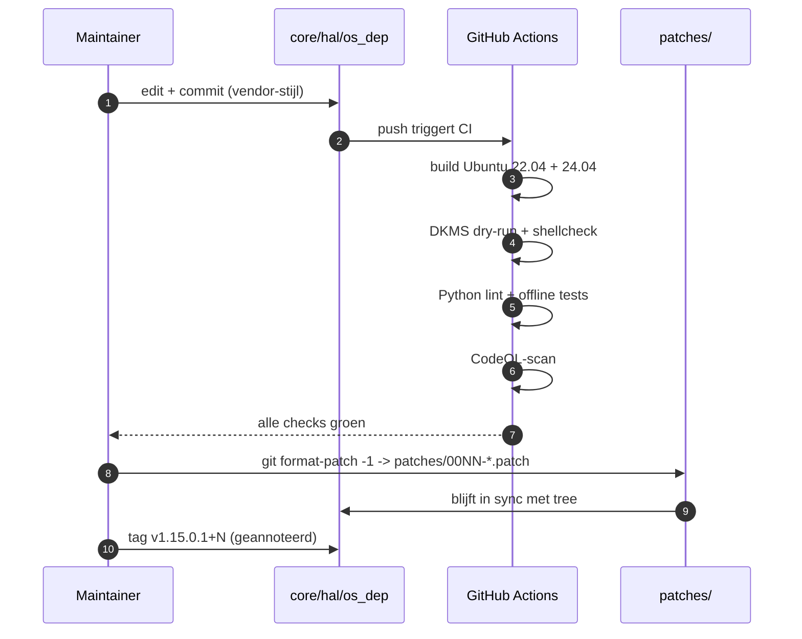
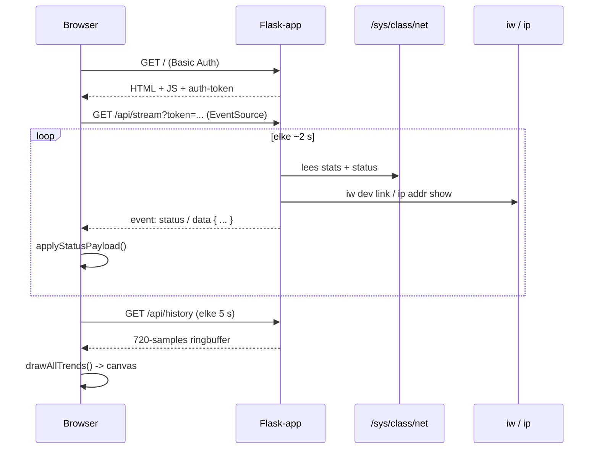

# Architectuur

[English](architecture.md) | **Nederlands**

Een vogelvlucht over hoe de bewegende delen in deze repository
samenwerken. Handig als je net de fork hebt gecloned en je afvraagt
waar je het eerst moet kijken.

## Componenten in één oogopslag

```mermaid
flowchart TB
    subgraph Hardware ["Hardware"]
        ADAPTER([RTL8852AU USB-adapter])
    end

    subgraph Kernel ["Linux kernel-ruimte"]
        USBCORE[usbcore]
        CFG80211[cfg80211 / mac80211]
        DRIVER[8852au.ko<br/>out-of-tree module]
        SYSFS[/sys-filesystem]
    end

    subgraph BuildPath ["Build-pad"]
        VENDOR[Realtek vendor-bron<br/>v1.15.0.1-2]
        PATCHES[patches/0001..0008<br/>post-baseline fixes]
        MAKEFILE[Makefile]
        DKMS[dkms-install.sh<br/>dkms.conf]
        FW[firmware-blob<br/>hal8852a_fw.c.xz<br/>CHECKSUMS.sha256]
    end

    subgraph UserSpace ["User-space helpers"]
        DASHBOARD[dashboard/app.py<br/>Flask + SSE]
        TESTS[tests/test_driver.py<br/>+ run_tests.sh]
        TOOLS[tools/tapo_rtsp_brute.py]
    end

    subgraph CI ["GitHub Actions CI"]
        BUILD[Build-matrix<br/>Ubuntu 22.04/24.04]
        LINT[Python lint<br/>+ pip --require-hashes]
        DKMSCI[DKMS dry-run<br/>+ shellcheck]
        CODEQL[CodeQL]
    end

    ADAPTER -- USB --> USBCORE
    USBCORE -- bind --> DRIVER
    DRIVER -- registreert --> CFG80211
    DRIVER -- toont --> SYSFS
    DRIVER -- laadt --> FW

    VENDOR --> MAKEFILE
    PATCHES -. geintegreerd in tree .-> VENDOR
    MAKEFILE -- compileert --> DRIVER
    DKMS -- bouwt + installeert --> DRIVER

    DASHBOARD -- leest --> SYSFS
    DASHBOARD -- roept aan --> CFG80211
    TESTS -- test --> DRIVER
    TESTS -- roept aan --> CFG80211

    MAKEFILE --> BUILD
    DASHBOARD --> LINT
    TESTS --> LINT
    DKMS --> DKMSCI
    DASHBOARD --> CODEQL
    TESTS --> CODEQL
```

## Waar wat staat

| Map                       | Wat erin staat                                                                  |
|---------------------------|---------------------------------------------------------------------------------|
| `core/`, `hal/`, `phl/`   | Realtek vendor-driver-bron. Bewaar de vendor-stijl; raak het spaarzaam aan.     |
| `os_dep/linux/`           | Linux-glue laag — netdev, cfg80211, sysfs, USB. Hier landen de meeste fork-fixes.|
| `include/`                | Gedeelde headers. UBSAN flex-array-fix in `include/ieee80211.h`.                |
| `phl/hal_g6/mac/fw_ax/`   | Firmware-blob (`hal8852a_fw.c.xz`, geverifieerd via `CHECKSUMS.sha256`).        |
| `Makefile`, `common.mk`   | Top-level build. Kiest kernel-headers en compileert `8852au.ko`.                |
| `dkms.conf`, `dkms-*.sh`  | DKMS-integratie; herbouwt automatisch bij kernel-upgrades.                       |
| `patches/`                | Losse `git format-patch`-bestanden voor de post-baseline fixes (0001–0008).     |
| `dashboard/`              | Flask + Server-Sent-Events web-UI. Leest sysfs + `iw` voor live status.         |
| `tests/`                  | Python `unittest`-suite + `run_tests.sh`-wrapper.                                |
| `tools/`                  | Losse research-tools (RTSP-credential-finder, etc.).                            |
| `docs/`                   | Architectuur- en dashboard-handleidingen (deze map).                            |
| `.github/`                | CI-workflow, dependabot, issue + PR-templates, CODEOWNERS.                      |

## Levensloop van een driver-fix



## Levensloop van een status-update in het dashboard



## Waarom de splitsing tussen `patches/` en de tree

Elke post-baseline-wijziging staat **op beide plekken**:

- **In de tree** zodat `make` direct een werkende module produceert
  — geen patch-apply-stap nodig voor eindgebruikers.
- **In `patches/`** als losse `git format-patch`-bestand zodat
  downstream-maintainers die alleen de Realtek-baseline volgen
  `git am patches/*.patch` kunnen doen en dezelfde tree-staat
  krijgen.

`patches/README.md` is de canonieke index. `CHECKSUMS.sha256`
voorkomt dat de firmware-blob stilletjes verandert.

## Vertrouwens-grenzen

| Grens                            | Wat passeert                                          | Hoe het is beheerst                                          |
|----------------------------------|-------------------------------------------------------|--------------------------------------------------------------|
| Kernel ↔ user-space              | `iw`, `ip`, `dmesg`, sysfs-reads                     | Standaard Linux capability-model (CAP_NET_ADMIN voor ip/iw)  |
| Browser ↔ Flask                  | HTTP-requests + Server-Sent Events                    | HTTP Basic Auth + Host-header-whitelist + token-query-param |
| Extern netwerk ↔ dashboard       | Standaard loopback; opt-in voor `--host 0.0.0.0`     | Zelfde auth als hierboven. Token is het enige geheim         |
| PR-bijdrager ↔ main-branch       | Pull requests, fork-PR-workflow-runs                  | Branch-protection: CI verplicht, force-push geblokkeerd, geen fork-secrets-blootstelling |
| Realtek-blob ↔ runtime           | Firmware geladen door driver bij init                 | SHA-256 geverifieerd in CI (`CHECKSUMS.sha256`)              |

## Leesvolgorde voor nieuwe bijdragers

1. `README.md` — wat het project is en hoe je het bouwt.
2. `docs/architecture.md` (dit bestand).
3. `patches/README.md` + een paar `patches/000*.patch`-bestanden —
   kijken hoe een gerichte fix er in deze codebase uitziet.
4. `CONTRIBUTING.md` — de vendor-stijl-regel en de PR-flow.
5. `docs/dashboard.md` als je het dashboard wilt aanraken.
6. `tests/test_driver.py` als je een test wilt toevoegen.
